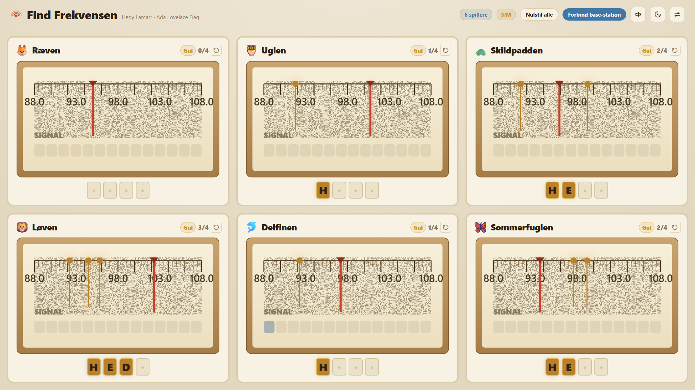

# Find Frekvensen 📡

An interactive drop-in station for **Ada Lovelace Day** (Coding Pirates Odense).
Children use a micro:bit as a "radio receiver": they tilt it to sweep a needle
across a radio dial on a big TV, hunt hidden signals by their signal strength,
lock onto them, and collect a secret message. On the harder levels the signal
**slides across the dial** and you have to follow it to hold on — Hedy Lamarr's
frequency-hopping idea, made catchable.

4–8 (up to 10) children tune at once, each with their own micro:bit and their own
field on the screen.



## How it works

```
[Receiver micro:bit ×N]  --radio-->  [Base-station micro:bit] --USB/serial--> [Next.js app on TV]
   (a child holds it)                   (plugged into the PC)                   (split into N fields)
```

One-way data flow, kept deliberately simple for reliability. **All game content
(station positions, the secret message, how the signal moves) lives in the web app** —
the firmware is "dumb" and only reports its own needle position. So difficulty
and puzzles can be changed live with no re-flashing, and the whole game runs and
is tested **without any hardware** via the built-in simulator.

## Run it on the day — the portable .exe (recommended)

The whole app is packaged as a **single self-contained Windows .exe**. It bundles
its own Chromium, runs fully offline, needs nothing installed on the venue PC,
and **auto-connects to the base-station micro:bit** (no browser, no port picker).

- Build it: `npm run exe` → produces `dist/Find-Frekvensen-<version>.exe`
- Copy that one file to a USB stick, double-click it on the venue PC.
- It opens fullscreen. Plug in the base station and it connects automatically
  (F11 toggles fullscreen, Esc leaves it, Ctrl+Q quits).

Rebuild the exe whenever the app changes — just run `npm run exe` again.

## Develop / run in a browser

Requirements: Node 20.9+ and **Chrome or Edge** (Web Serial API).

```bash
npm install
npm run dev      # http://localhost:7430  (development)
```

Or serve the built static app in a browser (Chrome/Edge) without the exe:

```bash
npm run build    # writes the static site to out/
npm run serve    # serves out/ at http://localhost:7430
```

In a browser, click **Forbind base-station** and pick the micro:bit's port; press
**F11** for fullscreen on the TV.

### Try it with no hardware

Add `?sim=1` to spin up virtual devices, e.g.:

- `http://localhost:7430/?sim=1&fields=6&mode=solve` — 6 fields that solve themselves
- `http://localhost:7430/?sim=1&fields=8&mode=sweep&preset=red` — 8 fields, red difficulty
- URL params: `sim`, `fields` (1–10), `devices`, `mode` (`sweep`/`solve`/`manual`/`idle`), `preset` (`green`/`yellow`/`red`), `theme`, `debug`

## Controls

| Key | Action |
|-----|--------|
| `d` | Toggle the debug / operator panel |
| `1`–`0` | Select the active field |
| `← →` | Move the active field's needle (with the simulator) |
| `r` | Reset all fields |

The **debug panel** (press `d`) is the operator cockpit: pick difficulty live,
set the number of fields (1–10), choose a theme, edit the secret message, switch
between word and picture mode, drive the simulator, connect/reconnect serial, and
watch the raw serial monitor, device table, and FPS. It hides completely so the
children never see it.

## Difficulty

Three rungs, and **each field climbs them independently** — a child who finishes
a level moves up on their own screen while their neighbours stay where they are.
A newly connected micro:bit starts on grøn.

- **Grøn** — 3 wide, clustered stations, standing still. Spells `ADA`.
- **Gul** — 4 narrower stations, spread out, and the signal now **moves**: it
  slides back and forth around its home position at 110 units/s. Spells `HEDY`.
- **Rød** — 5 narrower stations still, moving faster (135 units/s) and wandering
  further, and the directional arrow only appears when you are nearly on top of
  one. Spells `GRACE`.

The moving levels are tuned so a *still* needle can never catch a signal: it
passes through a station's window in less time than the lock hold requires, so
you have to track it. Both **word mode** (a letter per station) and **picture
mode** (a puzzle tile per station) are supported and switchable per difficulty.

## Firmware

See [`firmware/README.md`](firmware/README.md) for flashing the receiver and
base-station micro:bits (MakeCode) and tuning the tilt feel.

## Screenshots & self-test

```bash
npm run dev          # in one terminal
npm run shots        # in another — writes /screenshots at 1080p and 4K
```

`npm run shots` drives the app (in simulator mode) through every key UI state —
waiting, static, warming up, locking, progress, complete, 4/6/8 layouts, picture
mode, red level, dark mode, and the debug panel — and saves PNGs for review.

## Project notes

Working notes for AI assistants and future sessions live in
[`ai-instructions/`](ai-instructions/) (architecture, features, decisions,
session log).

## Tech

Next.js 16 (App Router) · TypeScript · React 19 · Tailwind v4 · Zustand ·
Canvas rendering · Web Serial API · Playwright. No backend, no internet needed
on the day.
