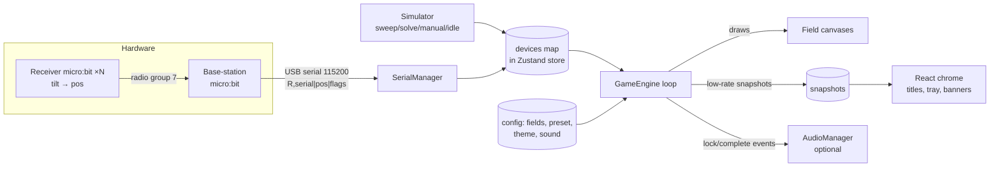

# Architecture

## Data flow

The key idea: **sim and serial both write the same `devices` map**, and the
engine only reads that map. So the game is identical with or without hardware.

## Module map

| Path | Responsibility |
|------|----------------|
| `src/game/types.ts` | All domain types. |
| `src/game/tokens.ts` | Single source of colours + sizes (canvas + DOM). |
| `src/game/themes.ts` | Field identities (icon/name/accent) per theme. |
| `src/game/pictures.ts` | Inline-SVG scenes for picture mode. |
| `src/game/presets.ts` | Difficulty presets + default config. |
| `src/game/gameFactory.ts` | Build stations/decoys from a preset; hop logic. |
| `src/game/store.ts` | Zustand store (config/devices/snapshots/serial/sim/debug). |
| `src/game/engine.ts` | The loop: assignment, game logic, draw, snapshots, events. |
| `src/render/drawField.ts` | Retro dial rendering (faceplate + dynamic layers). |
| `src/render/noise.ts` | Pre-baked snow tiles. |
| `src/render/confetti.ts` | Completion particles. |
| `src/sim/simulator.ts` | Virtual devices → device map. |
| `src/serial/protocol.ts` | Parse `R,serial|pos|flags`. |
| `src/serial/webserial.ts` | Web Serial connect/read/reconnect. |
| `src/audio/sound.ts` | Optional WebAudio SFX. |
| `src/components/*` | TopBar, FieldGrid, RadioField, MessageTray, PictureReveal, DebugPanel. |
| `src/lib/useAppRuntime.ts` | Boots engine/sim/serial/audio, keyboard, URL params, test API. |
| `src/app/*` | Layout + page shell. |
| `firmware/*` | MakeCode receiver + base-station. |
| `scripts/shots.mjs` | Playwright screenshot self-test. |

## Field lifecycle

`waiting` → (device assigned) → `tuning` → (all stations locked) → `complete`
→ (after `completeHoldMs`) → back to `tuning` (device still present) or
`waiting` (device offline > 2 s).

## Serial protocol

`R,<serial>|<pos>|<flags>\n` at 115200 baud. `serial` = device serial (int,
may be negative), `pos` = 0–1000, `flags` = bitmask (bit0 A, bit1 B). Malformed
lines are counted as parse errors in the debug panel, never crash.
